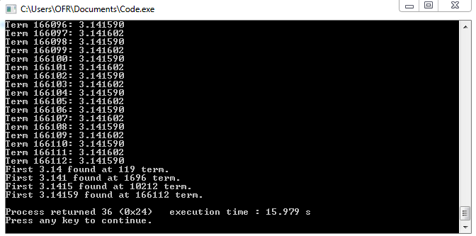

# Calculating-the-value-of-pi-in-C
This is a simple code in C where the value of Pi is calculated using The infinite Gregory-Leibniz Series.
The real question is shown in below: 

And the Output is shown in below:

